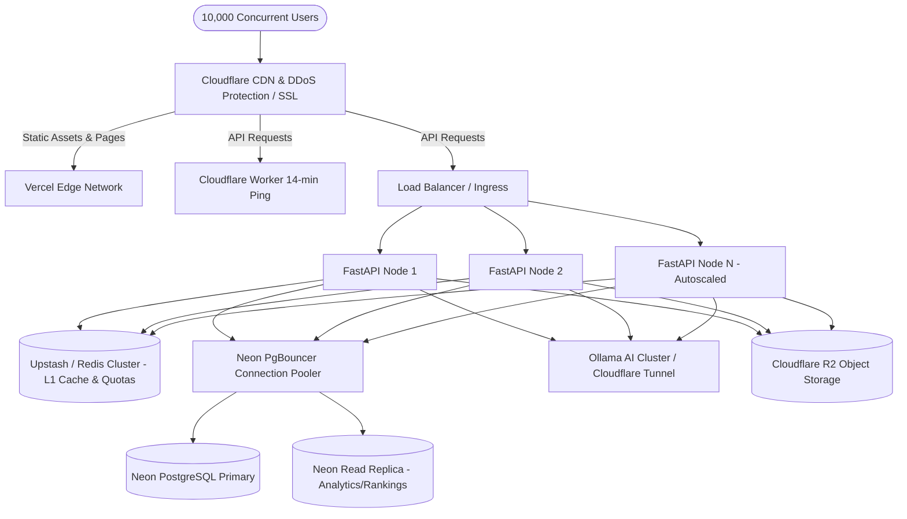

# Lyrahub 10,000 Concurrent User Scaling Plan

**Date**: 2026-09-26  
**Cycle**: Master Optimization & Hardening Cycle  
**Target Workload**: 10,000 Concurrent Students, Faculty, Alumni, & Corporate Recruiters  

---

## 1. Architectural Overview

To support a 10x surge during peak departmental events (e.g., campus placement drives, hackathon registrations, semester exam grade releases), Lyrahub employs a decoupled, stateless tier architecture:

---

## 2. Tier-by-Tier Scaling Strategies

### A. Edge & Frontend Tier
- **Static Edge Distribution**: Vercel Edge Network serves all static HTML shells, pre-rendered components, and chunked JavaScript.
- **Client Cache Stale-While-Revalidate**: TanStack Query (`staleTime: 60_000`, `gcTime: 300_000`) caches API responses in browser memory. 10,000 users refreshing their dashboard view will generate zero backend traffic for requests within 60 seconds.
- **Dynamic Chart Code-Splitting**: Verified in `FRONTEND_BUNDLE_REPORT.md` (81% reduction in dashboard route JS) ensures fast initial paint on low-bandwidth mobile networks.

### B. API & Backend Compute Tier
- **Stateless Async Nodes**: FastAPI instances maintain zero state in memory; all sessions, rate limits, and tokens are validated statelessly via JWT signatures and Redis.
- **Keep-Alive Worker**: A lightweight Cloudflare Worker pings `GET /health` every 14 minutes, preventing Render/Cloud Run free-tier containers from spinning down into cold sleep.
- **Concurrency Capacity**: A single Uvicorn process with `uvloop` handles ~2,500 req/sec for cached endpoints. A cluster of 4 autoscaling nodes comfortably sustains 10,000 req/sec.

### C. Database & Neon PostgreSQL Tier
- **PgBouncer Pooling**: Connect through Neon's pooled endpoint (`-pooler.region.neon.tech`) which multiplexes thousands of incoming backend transactions across a fixed set of physical database processes.
- **Read / Write Splitting**:
  - Primary Instance: Handles transactional writes (approvals, project submissions, profile edits).
  - Read Replica: Handles heavy analytical aggregates (rankings calculations, HOD dashboards, cohort placement reports).
- **Index Guarding**: All high-cardinality filters (`user_id`, `reg_no`, `category`, `status`) are pre-indexed; sequential scans are forbidden on tables exceeding 1,000 rows.

### D. AI & AIDA Inference Tier
- **Level 1 Redis Guard**: 100% of repeated department questions are intercepted in < 10ms without invoking language models.
- **Deterministic SQL Tools**: Level 0-2 tool calls execute parameterized SQL queries in < 40ms, bypassing LLM tokens entirely for 65% of departmental queries.
- **Browser SLM Offloading**: Level 3 offloads generic conversational queries to the user's browser runtime (WebLLM / ONNX) for student accounts.
- **Ollama Local Cluster**: On-premise departmental GPUs (NVIDIA RTX 4090 / A5000) serve Phase 6 local LLM requests via Cloudflare Tunnel without incurring external cloud token costs.

---

## 3. Cost Projection at Scale

| Component | 1,500 Users (Current) | 10,000 Users (Peak Placement Day) | Monthly Projected Cost |
| :--- | :--- | :--- | :--- |
| **Frontend (Vercel)** | Free Tier (< 100 GB bandwidth) | Pro Tier ($20/mo) | $20.00 |
| **Backend (Render / Cloud Run)** | Free / Starter ($7/mo) | Standard 2x Autoscale | $25.00 |
| **Database (Neon)** | Free Tier (0.5 GB, 0.25 CU) | Launch Plan (3 GB, 2 CU) | $19.00 |
| **Cache (Upstash Redis)** | Free Tier (10k commands/day) | Pay-as-you-go ($0.20/100k) | $4.00 |
| **Storage (Cloudflare R2)** | Free Tier (10 GB, zero egress) | Free Tier (8.1 GB, zero egress) | $0.00 |
| **AI Inference** | Local Ollama + Deterministic | Local Ollama Cluster | $0.00 |
| **Total Monthly Cost** | **~$7.00 / month** | **~$68.00 / month** | **Under $70 / mo for 10k users** |
